# Script thuyết trình GTM và GA4 — nguồn tạo slide

> Đây là tài liệu chính để chuẩn bị lời thoại và tạo file PPT. Mỗi slide gồm: mục tiêu, nội dung hiển thị, lời thoại, tài liệu tham khảo cần mở và checklist. Khi hoàn thiện script, chúng ta sẽ dùng đúng cấu trúc này để tạo slide tương ứng.
>
> **Thời lượng:** 110 phút. **Trọng tâm:** khái niệm, định nghĩa và cách quản lý hiệu quả GA4/GTM.

## Quy ước dùng script

- `[CẦN BỔ SUNG]`: thông tin thực tế cần người dùng cung cấp.
- `[NGUỒN CHUẨN BỊ: path]`: file dùng để chuẩn bị nội dung; không mở trong lúc trình bày kiến thức.
- **Nội dung trên slide:** chữ ngắn, sơ đồ hoặc bảng; không đưa nguyên văn lời thoại lên slide.
- **Lời thoại:** phần người trình bày thực sự chia sẻ.
- **Checklist:** điều kiện để xem phần đó đã đủ sẵn sàng.
- Toàn bộ pattern, định nghĩa, record, template, workflow và evidence trong script phải được tham chiếu từ bộ tài liệu chuẩn Section 00 đến Section 10, bắt đầu từ `00-change-request-governance.md` đến `10-release-monitoring-answer.md`.
- Các file `*-vn.md` chỉ là bản hỗ trợ ngôn ngữ; nội dung chuẩn cần đối chiếu với file research gốc tương ứng.

**Bản đồ nguồn chuẩn cho nội dung thuyết trình:**

| Section | Nội dung chuẩn cần tham chiếu                                                      |
| ------- | ---------------------------------------------------------------------------------- |
| 00      | Change Request, lifecycle, traceability, risk, approval, evidence và template      |
| 01      | Data Layer boundary, contract, payload, naming, privacy và handoff                 |
| 02–04   | Variable, Trigger, Tag, asset lifecycle và inventory                               |
| 05–06   | Consent và template governance                                                     |
| 07      | Measurement Plan, Event Contract, Parameter Dictionary và schema lifecycle         |
| 08      | Debug, QA records, evidence template và first-failing-layer diagnosis              |
| 09      | Report, Exploration, field readiness, metric discipline và interpretation evidence |
| 10      | Release record, monitoring record, smoke test, incident, rollback và closure       |

## 0. Thông tin cần chốt trước khi review

- Audience chính: Các thành viên trong team dự án.
- Mục tiêu của stakeholder: Truyền đạt lại kiến thức research về cách quản lý GTM và GA4 cho team.
- Hình thức: `lecture / workshop / review / kết hợp`
- Có demo runtime được cấp quyền không?: `Không áp dụng cho phần kiến thức; runtime evidence nằm ngoài phạm vi script này.`
- Environment được phép dùng: `[CẦN BỔ SUNG]`
- Người ghi câu hỏi và action sau buổi nói: `[CẦN BỔ SUNG]`

### Nguyên tắc biên tập

Mỗi phần chính phải trả lời ba câu hỏi:

1. Khái niệm này là gì?
2. Vì sao cần quản lý nó?
3. Checklist hoặc quy trình nào giúp quản lý tốt?

## 1. Agenda và trạng thái chuẩn bị

| Thời gian | Slide/phần | Nội dung                            | Trạng thái |
| --------: | ---------- | ----------------------------------- | ---------- |
|      0–15 | 1–3        | Vấn đề hiện tại của project         | ☐          |
|     15–30 | 4–5        | Core GTM/GA4 value and definitions  | ☐          |
|     30–40 | 6–7        | Architecture and event lifecycle    | ☐          |
|     40–52 | 8–9        | Measurement Plan and Event Contract | ☐          |
|     52–62 | 10–11      | Data Layer                          | ☐          |
|     62–72 | 12–13      | Variables, Triggers, and Tags       | ☐          |
|     72–80 | 14         | Consent and Template Governance     | ☐          |
|     80–90 | 15–16      | Debugging and Analytics QA          | ☐          |
|     90–98 | 17         | Reports, Release, and Monitoring    | ☐          |
|    98–106 | 18         | Change Request Governance           | ☐          |
|   106–110 | 19         | Conclusion and Next Actions         | ☐          |

---

## 2. Opening: Current Project Issues — Slides 1–3, 0 to 15 minutes

### Slide 1 — Why Do We Need to Govern GTM/GA4?

**Mục tiêu:** đặt bối cảnh trước khi đi vào lý thuyết.

**Nội dung trên slide:**

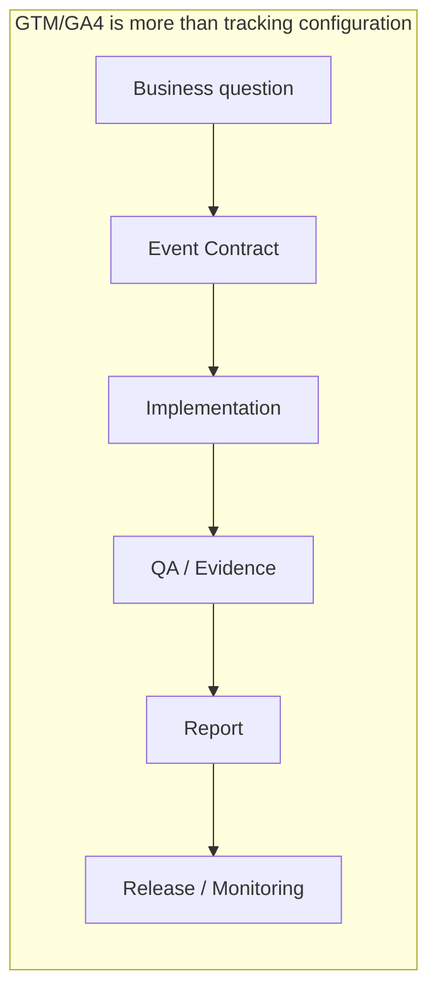

**Lời thoại:**

1. Nhiều người nghĩ GTM hay GA4 chỉ đơn giản là lên gắn vài cái Tag để lấy dữ liệu. Nhưng nếu nhìn vào sơ đồ này, mọi người sẽ thấy: đó là một quy trình quản lý khép kín từ đầu đến cuối.

2. Đầu tiên là **Business question**. Chúng ta phải biết doanh nghiệp cần trả lời câu hỏi gì, từ đó mới biết nên đo event nào. Có câu hỏi rồi, mình mới chốt **Event contract** — tức là thống nhất event này nghĩa là gì, phát ra khi nào, có những thông số gì và có bị vi phạm dữ liệu hay không.

3. Đến bước thứ 3 mới là **Implementation**. App phát event, Data Layer chuyển tiếp, GTM đọc và route về GA4. Đây thực ra chỉ là một mắt xích kỹ thuật trong cả chuỗi.

4. Kế tiếp là **QA & Evidence**. Ở bước này, chúng ta cần bằng chứng rõ ràng: Event phát đúng không? GTM match đúng trigger không? Consent có được tuân thủ không? Việc 'Tag đã fire' chưa bao giờ là bằng chứng đầy đủ.

5. Khi dữ liệu chuẩn rồi, mình mới dựng **Report** để trả lời câu hỏi ban đầu. Và cuối cùng là **Release & Monitoring**. Bất kỳ thay đổi nào trên production cũng cần approval, smoke test và theo dõi sau release để tránh hỏng báo cáo.

### Slide 2 — Current Project Issues

**Mục tiêu:** đưa issue lên đầu, nhưng không biến slide thành danh sách lỗi không có owner.

**Nội dung trên slide:**

### Current Project Issues & Technical Debt

#### PILLAR 1: DOCUMENTATION & STANDARDIZATION DEBT

| # | Issue | Signal / Example | Operational Impact |
| ---: | --- | --- | --- |
| 01 | Scattered Measurement Plan & Documentation | Jira: HGRS-829, BLUE-495 | Slower Change Requests |
| 02 | Non-standard, non-semantic naming conventions | `inputs.SubApp`, `beamA_isRough` | Low maintainability |
| 03 | Inconsistent missing-data handling logic | FD: `omit` vs. HS: `"N/A"` | QA & Report friction |

#### PILLAR 2: DATA LAYER COUPLING & REDUNDANCY

| # | Issue | Signal / Example | Operational Impact |
| ---: | --- | --- | --- |
| 04 | UI-dependent, overly broad Data Layer payload | `inputs` mapped to UI DOM text | Fragile on UI updates |
| 05 | Redundant payload attributes | `app_action` duplicates Event | Conflicting metrics |

#### PILLAR 3: GOVERNANCE, PRIVACY & RELEASE RISK

| # | Issue | Signal / Example | Operational Impact |
| ---: | --- | --- | --- |
| 06 | Lack of cross-project governance & ownership | No unified review/QA process | Siloed execution |
| 07 | Unclear separation between Staging & Prod | Missing environment routing | Staging data in Prod |
| 08 | Consent default set to `granted` without policy | Default `granted` / No CMP audit | Compliance & Legal risk |
| 09 | Unversioned & untracked GTM deployments | Publish without release tag | Unsafe Rollbacks |


**Lời thoại:**

1. Mở đầu & Định hình phạm vi
   * Chào mọi người, trước khi chúng ta thảo luận về các giải pháp chuẩn hóa, hãy cùng nhìn thẳng vào bức tranh hiện trạng và các điểm nghẽn kỹ thuật (Technical Debt) đang tồn tại.
   * Qua quan sát các dự án thuộc hệ sinh thái et-blueprint — bao gồm HS, FD hay ACE — những bất cập hiện tại không nằm ở sự cố lẻ tẻ, mà chia thành 3 nhóm vấn đề hệ thống cốt lõi.

2. Nhóm 1: Sự thiếu chuẩn hóa & Dữ liệu bị phân tán (Documentation & Standardization Debt)
   * **Tài liệu rải rác**: Spec tracking và quy định cấu hình GTM hiện nằm phân tán trên nhiều ticket Jira như HGRS-829 hay BLUE-495. Khi cần sửa đổi hay làm Change Request, team tốn rất nhiều thời gian lục lại lịch sử để đối chiếu.
   * **Naming không có chuẩn chung**: Các tên trường như inputs.SubApp hay beamA_isRough không tuân theo quy chuẩn ngữ nghĩa (semantic naming). Khi nhìn vào danh sách Variables trên GTM, ta không thể biết biến đó phục vụ dự án nào, dùng làm gì, dẫn đến việc khó duy trì và tái sử dụng.
   * **Missing-data thiếu thống nhất**: Cùng một trường dữ liệu bị ẩn trên giao diện, bên FD chọn cách bỏ qua (omit), trong khi bên HS lại gửi về giá trị dạng chuỗi "N/A". Sự lệch pha này gây bối rối trực tiếp cho team QA lẫn team Data khi tổng hợp Báo cáo.

3. Nhóm 2: Cấu trúc Data Layer bị phụ thuộc UI & Dư thừa (Data Layer Coupling & Redundancy)
   * **Phụ thuộc quá chặt vào UI**: Payload hiện gom toàn bộ object inputs và lấy text trực tiếp từ giao diện. Chỉ cần Front-end thay đổi cách hiển thị hoặc đổi nhãn button là dữ liệu tracking lập tức đứt gãy hoặc sai lệch, dù bản chất nghiệp vụ không thay đổi.
   * **Dữ liệu dư thừa**: Tồn tại các trường thông tin trùng lặp vô ích. Ví dụ: trường app_action mang đúng giá trị của event_name. Việc này không chỉ làm phồng dung lượng payload mà còn gây xung đột khi định nghĩa chỉ số.

4. Nhóm 3: Thiếu Quy trình Quản trị, Rủi ro Bảo mật & Release (Governance, Privacy & Release Risk)
   * **Thiếu Governance xuyên dự án**: Chúng ta chưa có quy trình chung từ khâu duyệt Event Contract, phân định Ownership, cho tới QA, Release hay Deprecate các tag cũ.
   * **Môi trường Staging và Production nhập nhằng**: Chưa có rào chắn (guardrails) và cơ chế routing rõ ràng, dẫn đến rủi ro dữ liệu kiểm thử ở Staging bị đẩy thẳng vào GA4 Property của Production.

5. Nhấn mạnh Rủi ro Consent & Quản lý Phiên bản (Consent & Release Governance)
   * **Rủi ro Consent & Privacy**: Trạng thái Consent mặc định hiện đang set là granted khi chưa có chính sách (policy) phê duyệt hoặc CMP chính thức. Đây là một khoảng trống lớn về Tuân thủ Bảo mật Dữ liệu (Privacy Gap) chứ không đơn thuần là lỗi cài đặt Tag trên GTM.
   * **Thiếu Release Versioning**: Sau khi hoàn thành thay đổi, GTM Container không được Publish hoặc được Publish mà không có Release Tag hay Named Version rõ ràng. Khi xảy ra sự cố trên Production, team không có điểm đối chiếu (Baseline) và không thể Rollback an toàn.

### Slide 3 — From Issues to Management Questions

**Mục tiêu:** chuyển 9 issue thực tế thành các câu hỏi quản lý và record cần có.

**Nội dung trên slide:**

| Issue Group                        | Management Question                                                | Required Pattern / Record                            |
| ---------------------------------- | ------------------------------------------------------------------ | ---------------------------------------------------- |
| Scattered documentation            | Which business question does the event support? Who approves it?   | Measurement Plan + Event Contract                    |
| Broad payload / redundant fields   | Which business facts are actually required in the Data Layer?      | Minimal schema + allowlist                           |
| Inconsistent missing-data behavior | What happens when data is missing or invalid?                      | Missing-data policy + test matrix                    |
| Non-standard naming                | What is the canonical name, and can the asset be reused?           | Naming convention + asset inventory                  |
| Missing governance                 | Who owns, reviews, releases, and monitors the change?              | Owner + lifecycle + evidence                         |
| Consent defaults to granted       | Is collection before user choice authorized, and which consent types/regions apply? | Approved consent contract + CMP mapping + default/update/revocation QA |
| No named publish version after change | Which deployed version is active, and how do we trace or roll it back safely? | Named version + verified baseline + publish/rollback record |
| Unclear environment separation     | Which environment is receiving the data, and who controls routing? | Environment scope + routing guardrail + release gate |

**Lời thoại:**

1. "Vậy từ các vấn đề này, câu hỏi quản lý đặt ra là gì và chúng ta cần những pattern hay record nào để giải quyết?"

2. Với vấn đề **tài liệu phân tán**, chúng ta cần xác định event phục vụ business question nào, occurrence hợp lệ là gì, ai là owner và ai phê duyệt. Đây là vai trò của Measurement Plan và Event Contract.

3. Với vấn đề **payload quá rộng hoặc có field trùng lặp**, câu hỏi là Data Layer thực sự cần gửi business fact nào. Payload nên được tối giản theo allowlist, không lấy dữ liệu chỉ vì nó đang có trên UI và không truyền lại một ý nghĩa đã được thể hiện trong event name.

4. Với vấn đề **missing-data behavior**, cần có một policy chung: field nào bắt buộc, field nào tùy chọn, khi thiếu thì omit, gửi giá trị thay thế hay block event. Policy này phải được đưa vào test matrix để FD và HS cho ra hành vi có thể dự đoán.

5. Với vấn đề **naming**, team cần có canonical naming convention và asset inventory để biết một event, parameter, trigger hoặc tag đã tồn tại chưa, đang được ai sở hữu và có thể reuse trong phạm vi nào.

6. Với vấn đề **environment**, cần xác định rõ staging và production trong scope, contract, GTM routing và release record. Environment không chỉ là thông tin kỹ thuật; nó là một release boundary để ngăn việc test nhầm production hoặc publish nhầm phiên bản.

7. Với vấn đề **consent auto-granted**, câu hỏi đầu tiên không phải là sửa một checkbox trong GTM. Team phải xác định policy nào cho phép collection trước khi user chọn, consent type và region nào áp dụng, CMP gửi default/update từ đâu, và behavior denied hoặc unknown là gì. Nếu chưa có policy được phê duyệt, phải xem đây là một governance gap và fail-safe, không tự mặc định là granted.

8. Với vấn đề **publish version**, sau mỗi change cho project version mới phải có named version hoặc release reference, verified baseline, publisher, target environment và rollback path. Nếu không, team không thể xác định deployed state hoặc đối chiếu lỗi với đúng phiên bản đã phát hành.

9. Cuối cùng, với vấn đề **governance**, phải trả lời được ai chịu trách nhiệm review, approve, release, monitor và retire thay đổi. Khi mỗi issue đều được nối với một decision, một owner và một evidence, chúng ta mới có thể quản lý theo pattern thay vì xử lý từng ticket riêng lẻ.

---

## 3. Core GTM/GA4 Value and Definitions — Slides 4–5, 15 to 30 minutes

### Slide 4 — What Value Do GTM and GA4 Create?

**Nội dung trên slide:**

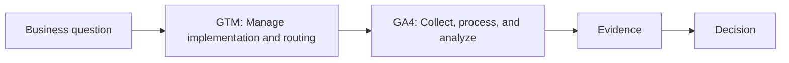

**Lời thoại:**

1. Trước khi bắt tay vào thiết kế event, chúng ta cần làm rõ ranh giới và giá trị cốt lõi của GTM và GA4.

2. **GTM (Google Tag Manager)** đóng vai trò quản lý khâu triển khai và định tuyến (Implementation & Routing). Nó nhận thông điệp từ Data Layer, áp dụng các quy tắc (rule), kiểm soát quyền riêng tư (consent) và điều hướng dữ liệu đến đúng nơi. GTM là tầng vận chuyển kỹ thuật, không phải nơi tự ý định nghĩa lại logic nghiệp vụ.

3. **GA4 (Google Analytics 4)** chịu trách nhiệm thu thập, xử lý và phân tích dữ liệu. Giá trị của GA4 không nằm ở việc chúng ta thu thập thật nhiều event hay dựng lên những dashboard trông rất bắt mắt. Dữ liệu GA4 chỉ thực sự có giá trị khi nó trả lời được một câu hỏi nghiệp vụ và giúp doanh nghiệp đưa ra một quyết định cụ thể.

4. Khi kết hợp hai công cụ này: GTM đảm bảo dữ liệu được vận chuyển chính xác và an toàn, còn GA4 biến dữ liệu đó thành bằng chứng (evidence) phục vụ phân tích. Nếu thiếu quản lý ở bất kỳ tầng nào, báo cáo đầu ra trông có vẻ hợp lý nhưng thực chất đang trả lời sai câu hỏi ban đầu.

5. **Tóm lại**: Chúng ta không bắt đầu bằng việc mở GTM lên tạo Tag hay mở GA4 chọn biểu đồ. Mọi thứ luôn phải đi đúng thứ tự: Bắt đầu từ Business Question → Triển khai qua GTM → Phân tích trên GA4 → Đưa ra Bằng chứng và Quyết định.


### Slide 5 — Core Measurement Concepts

**Nội dung trên slide:**

| Concept          | Short Definition                                                            |
| ---------------- | --------------------------------------------------------------------------- |
| Business fact    | A real business outcome or state that the application owns.                 |
| Event            | A defined occurrence of a business fact.                                    |
| Parameter        | An approved attribute that describes an event.                              |
| Valid occurrence | The condition under which an event is counted as valid.                     |
| Event Contract   | The shared definition of an event, its fields, rules, owner, and lifecycle. |

**Lời thoại:**

1. Ở slide này, chúng ta sẽ thống nhất với nhau về 5 khái niệm cốt lõi trước khi đi vào kiến trúc và Measurement Plan chi tiết. Mục tiêu là để toàn bộ team — từ Dev, QA đến Data — nói cùng một ngôn ngữ.

2. **Business fact**: Đây là kết quả hoặc trạng thái nghiệp vụ thực sự do Application làm chủ. Chúng ta không bao giờ nên bắt đầu từ một cú click hay một đoạn text thô trên UI rồi gọi đó là business fact.

3. **Event**: Đây là một lần phát sinh thực tế (occurrence) của business fact đó.

4. **Parameter**: Là các thuộc tính đã được phê duyệt để mô tả cho event. Nó không phải là toàn bộ state hay tất cả raw input đang có trên màn hình.

5. **Valid occurrence**: Khái niệm này trả lời câu hỏi: 'Khi nào thì event được tính là hợp lệ?' Đây chính là chìa khóa giúp chúng ta phân biệt giữa một lần tính toán (calculation) thực sự với một cú click nhầm, một callback bị lặp, hay một thao tác chưa hoàn tất của user.

6. **Event Contract**: Đây là thỏa thuận chuẩn chung giữa App, Data Layer, GTM, GA4 và khâu Báo cáo. Contract sẽ ghi rõ event có ý nghĩa gì, field nào được phép truyền, missing-data xử lý thế nào, ai sở hữu và lifecycle của event đó ra sao."

---

## 4. Architecture and Event Lifecycle — Slides 6–7, 30 to 40 minutes

### Slide 6 — Architecture Responsibilities

**Mục tiêu học tập:** sau slide này, team có thể chỉ ra component nào sở hữu quyết định nào, component nào chỉ được đọc/chuyển tiếp, và gate nào phải được kiểm tra trước khi kết luận một event đã được thu thập thành công.

**Slide content (English):**

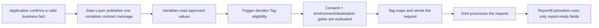

| Component         | Owns / may decide                                              | Boundary / must not do                                             |
| ----------------- | -------------------------------------------------------------- | ------------------------------------------------------------------ |
| Application       | Confirms valid occurrence, normalizes values, emits the event  | Must not make GTM infer the business outcome from clicks or DOM    |
| Data Layer        | Carries one complete, versioned contract message and allowlist | Must not send full state, PII, raw input, or stale values          |
| Variable          | Reads an Application-approved value                            | Must not recreate business logic or hide defects with fallbacks    |
| Trigger           | Decides whether a Tag is eligible to run                       | Must not send requests or replace the Application workflow         |
| Consent / routing | Controls collection permission and request destination         | Must not be treated as a secondary filter or assumed to be granted |
| Tag               | Maps the allowlist and sends the request to the destination    | Must not recalculate the business result or change event meaning   |
| GA4 / Report      | Processes data, checks field readiness, and supports analysis  | Must not be used to prove that upstream layers were correct        |


**Lời thoại:**

1. Mục tiêu của slide này là tạo ra một Boundary Map (bản đồ ranh giới) cho toàn bộ hệ thống. Chúng ta cần nắm rõ quyết định nào thuộc về component nào. Nếu đặt sai vị trí của một quyết định logic, dữ liệu đổ về GA4 có thể vẫn có, nhưng nó sẽ bị sai hoàn toàn về nghĩa nghiệp vụ.

2. Đi qua từng component trong chuỗi, chúng ta có các ranh giới bắt buộc như sau:

3. **Application** — Nơi duy nhất nắm giữ Business Truth: Chỉ có App mới biết user thực sự đã làm gì, API trả về kết quả ra sao và khi nào một business outcome chính thức hoàn tất.

4. Ví dụ: User bấm nút Calculate chưa chắc là đã tính toán thành công. App chỉ được phát event sau khi đã xác nhận một valid occurrence — dù đó là có kết quả, không có kết quả, hay gặp lỗi.

5. **Data Layer**: đóng vai trò mang event name, schema version và các trường thuộc allowlist trong một message duy nhất. Nếu chúng ta đẩy toàn bộ UI state, form input, response body hay token vào Data Layer, chúng ta đang mở rộng ranh giới dữ liệu không cần thiết, gây rủi ro lớn về Privacy và sai lệch dữ liệu.

6. Trong **GTM**, Variable chỉ trả lời "Giá trị nào được dùng?"; Trigger chỉ trả lời "Khi nào Tag đủ điều kiện chạy?"; và Tag chỉ trả lời "Gửi thông tin gì đi đâu?".

7. **Consent & Environment Routing**: Việc App push event vào Data Layer không đồng nghĩa với việc dữ liệu được phép thu thập. Cấu hình Consent, Environment (Staging vs Prod) và Destination phải hoạt động như các cổng gác (gatekeeper). Dữ liệu test ở Staging không bao giờ được phép route nhầm sang Production Measurement ID.

8. **GA4 & Report** — Tầng Downstream tiêu thụ dữ liệu: Một chart báo cáo hay một event xuất hiện trong DebugView chưa bao giờ là bằng chứng cho thấy App hay GTM trước đó đã xử lý đúng. Vì vậy, khi debug hoặc QA, team luôn phải kiểm tra ngược từ tầng phát sinh đầu tiên, không bao giờ bắt đầu từ việc nhìn Report.

9. Đây là reference architecture để team quản lý và phân công trách nhiệm; nó không có nghĩa Google bắt buộc mọi implementation phải có một pipeline tuyến tính duy nhất. Trong thực tế, Variables và Triggers là các lớp evaluation trong GTM, còn consent, exception, sequencing và destination settings có thể cùng tham gia quyết định Tag có thực sự gửi request hay không.


### Slide 7 — Event Lifecycle and Handoffs

**Mục tiêu học tập:** dạy team cách chuyển một business fact qua từng handoff mà không làm mất meaning, field, quyền collect hoặc destination; đồng thời biết evidence tối thiểu ở mỗi bước.

**Slide content (English):**

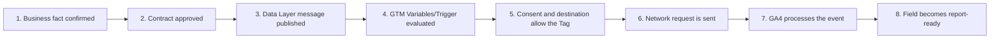

| Handoff                | Validation question                                                                       | Required evidence                                                    |
| ---------------------- | ----------------------------------------------------------------------------------------- | -------------------------------------------------------------------- |
| Application → Contract | Does the event have a clear business meaning and valid occurrence?                        | Measurement Plan / Event Contract, owner, version                    |
| Contract → Data Layer  | Does the message have the right fields, types, allowed values, and missing-data behavior? | Data Layer snapshot, schema/contract test                            |
| Data Layer → GTM       | Does GTM read the correct path and event name?                                            | GTM Preview, Variable values, Trigger result                         |
| GTM → Collection       | Do consent, exceptions, environment, and destination allow collection?                    | Consent state, tag status, routing decision                          |
| Tag → Network          | Does the request have the right event, parameters, Measurement ID, and count?             | Network request, request count, hostname                             |
| GA4 → Report           | Is the data processed, the field registered, and the scope suitable?                      | DebugView/Realtime, processed Report/Exploration, availability check |

**Lời thoại:**

1. Hãy nhìn vòng đời của một event như một chuỗi chuyển giao (handoff) có điều kiện. Ở mỗi nấc handoff, nếu không có bằng chứng kiểm tra, dữ liệu rất dễ bị biến dạng hoặc thất thoát mà chúng ta không hề hay biết.

2. **Handoff 1 & 2**: Từ App sang Contract
   > App xác nhận business fact phát sinh. Ngay lập tức, thông tin này phải đối chiếu với Event Contract đã được duyệt để đảm bảo: đúng event name, đúng phiên bản schema, làm rõ trường nào bắt buộc, trường nào tùy chọn, missing-data xử lý thế nào và ai là owner.

3. **Handoff 3**: Vào Data Layer
   > Data Layer push một message trọn vẹn (self-contained). Toàn bộ field nằm trong cùng một push, tuyệt đối không dựa vào các giá trị còn sót lại (stale values) của push trước đó.

4. **Handoff 4**: GTM Evaluation
   > GTM nhận message. Qua GTM Preview, chúng ta phải chứng minh được: Variable đọc đúng path, đúng kiểu dữ liệu và Trigger match đúng điều kiện. Nếu Trigger không match, hãy kiểm tra lại event name hay casing trước khi nghĩ đến việc sửa Tag.

5. **Handoff 5 & 6**: Consent, Destination & Network Request
   > Event có ở Data Layer nhưng nếu chưa có Consent thì Tag vẫn không được chạy. Khi Consent và Environment (Staging/Prod) cho phép, Tag mới phát Network request. Bằng chứng ở đây là: Đúng Measurement ID, đúng hostname, tham số nằm trong allowlist và không lọt dữ liệu nhạy cảm (PII).

6. **Handoff 7 & 8**: GA4 Processing & Report Readiness
   > Dữ liệu đến GA4 sẽ xuất hiện ở DebugView/Realtime. Nhưng để lên được Report, nó còn phải qua bước Field Readiness (nghĩa là một event/parameter đã sẵn sàng và đủ điều kiện để dùng trong Report hoặc Exploration của GA4): Parameter đã được đăng ký Custom Dimension chưa, đã qua processing window (24–48h) chưa, và có bị lệch Scope trong Exploration hay không.

7. Tóm lại: Khi Report thiếu dữ liệu, team sẽ truy ngược về layer gần nhất có bằng chứng đáng tin cậy. Không bao giờ dùng câu 'Tag đã fire' để kết luận dữ liệu đúng, và ngược lại, không dùng 'Report đã hiện' để bỏ qua QA upstream."

## 5. Measurement Plan and Event Contract — Slides 8–9, 40 to 52 minutes

### Slide 8 — Measurement Plan: Population and Decision

**Mục tiêu học tập:** dạy team bắt đầu từ business question và decision, sau đó mới chọn event, field, population và report; tránh tạo event chỉ vì một UI action đang dễ bắt.

**Slide content (English):**

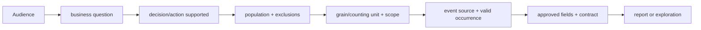

| Component         | Question to answer                                               |
| ----------------- | ---------------------------------------------------------------- |
| Audience          | Who will use the result and what do they need to understand?     |
| Business question | What specific business question must be answered?                |
| Decision/action   | What decision or action will change if the result changes?       |
| Population        | Who or what is included, and what is excluded?                   |
| Grain             | Are we counting users, sessions, events, items, or calculations? |
| Scope             | Is the field event-, user-, session-, or item-scoped?            |
| Occurrence        | When does one occurrence count as valid?                         |

**Lời thoại:**

1. Nhiều người nghĩ Measurement Plan đơn giản là danh sách các Event bảo Dev gắn vào code. Nhưng thực ra, đây là nơi chúng ta chứng minh dữ liệu lấy về để làm gì trước khi bắt tay vào triển khai.

2. **Audience và Decision**: Ai là người xem báo cáo và lấy dữ liệu này để quyết định việc gì? Nếu số liệu tăng hay giảm mà doanh nghiệp vẫn không làm gì khác đi, thì Event đó không cần thiết phải đo.

3. **Population**: Tập dữ liệu này tính trên ai? Chúng ta lọc bỏ nhân viên nội bộ, traffic test hay các thao tác bị hủy giữa chừng như thế nào?

4. **Grain** — tức đơn vị đếm: Chúng ta cần đếm bao nhiêu Người dùng (User), bao nhiêu Phiên (Session) hay bao nhiêu Lượt thực hiện (Event count)? Ba đơn vị này cho ra con số hoàn toàn khác nhau.

5. **Scope**: Trường thông tin này gắn liền với Event, với User hay với Session? Phải chốt rõ Scope ngay từ đầu để khi đưa lên báo cáo GA4 không bị lệch nghĩa.

6. **Occurrence** — tức điều kiện tính là hợp lệ: Ưu tiên dùng Event có sẵn của GA4. Nếu tự đặt tên, tên Event phải thể hiện đúng bản chất nghiệp vụ, tuyệt đối không đặt theo màu nút hay vị trí UI.

7. Ví dụ minh họa: Stakeholder muốn biết 'Có bao nhiêu lần tính toán thành công'. Nếu bắt Event ngay khi user click nút Calculate, đó mới là bấm nút, chưa chắc hệ thống đã tính xong. Đúng chuẩn là phải chờ App chạy xong API, có kết quả chuẩn, lúc đó mới được phát Event.

8. Measurement Plan giúp chúng ta chốt rõ: Cần câu trả lời gì -> Đo cái gì -> Khi nào tính là hợp lệ, trước khi giao cho Dev triển khai hay cấu hình GTM.

### Slide 9 — Event Contract and Schema Lifecycle

**Mục tiêu học tập:** dạy team biến một business requirement thành Event Contract và Parameter Dictionary mà Application, Data Layer, GTM, QA và Report có thể cùng tham chiếu; đồng thời nhận biết thay đổi nào cần tăng version, migration hoặc retirement.

**Slide content (English):**

```text
Event Contract
├─ 1. Meaning & Authority
│  ├─ Canonical Name & Type
│  ├─ Definition & Authoritative Moment (Server/App source of truth)
│  ├─ Valid Occurrence & Deduplication Rules (Retry/Refresh/Re-mount)
│  └─ Expected Frequency & Volume
│
├─ 2. Business & Measurement Alignment
│  ├─ Target Audience & Business Question / Decision
│  ├─ Population, Exclusions & Grain (User / Session / Event)
│  └─ Scope (Event-scoped vs User/Session/Item-scoped)
│
├─ 3. Parameter Dictionary (Field-Level Schema)
│  ├─ Field Name, Source, Type & Scope
│  ├─ Required / Optional Status & Allowed Values / Units
│  ├─ Missing / Invalid / Not-Applicable Policy (Omit vs Value substitution)
│  └─ GA4 Field Readiness & Custom Definition Registration Status
│
├─ 4. Handoff, Privacy & Safety Controls
│  ├─ Data Layer Signal & GTM Variable Mapping
│  ├─ Privacy Classification (PII Masking / Anonymization)
│  ├─ Consent Mode Requirements & Denied Behavior
│  └─ Target Environment & Destination Routing (Staging vs Production)
│
└─ 5. Lifecycle, Ownership & Governance
   ├─ Schema Version (e.g., v1.0.0) & Contract Owner / Approver
   ├─ Governance Status (Draft / Approved / Deprecated / Retired)
   └─ Effective Date, Review Cycle & Affected Data Consumers
```

| Type of Change                                           | Compatibility Classification | Required Action / Governance Strategy                                       |
| -------------------------------------------------------- | ---------------------------- | --------------------------------------------------------------------------- |
| **Add an Optional Field** (keep existing meaning)        | **Compatible**               | Update Contract, update Data Layer adapter, run regression QA.              |
| **Rename Event or Parameter**                            | **Breaking Change**          | Increment `event_schema_version`, update GTM mappings & Report definitions. |
| **Change Field Type, Allowed Values, or Missing Policy** | **Breaking Change**          | Increment version, update validation rules in QA Test Matrix.               |
| **Change Field Meaning** (same field name)               | **Semantic Breaking Change** | Create a new parameter or event name; do not reuse old fields.              |
| **Remove a Field** used downstream                       | **Breaking Change**          | Execute Migration Plan with transition period; set Retirement Date.         |

**Lời thoại:**

1. Nếu Slide 8 giúp chúng ta chốt các câu hỏi nghiệp vụ, thì Slide 9 sẽ chuyển hóa các quyết định đó thành Event Contract và Parameter Dictionary. Đây là bộ hồ sơ kỹ thuật chuẩn hóa duy nhất để Dev, QA và Data Analyst cùng dùng chung.

2. [Meaning & Authority] Ở phần 1, Contract quy định Tên chuẩn (Canonical Name), Mô tả nghiệp vụ, và đặc biệt là Authoritative Moment — tức thời điểm vàng trên App hoặc Server chứng minh Business Fact thực sự xảy ra. Đi kèm là quy tắc chống đếm trùng (Deduplication) khi user refresh hay bấm nút nhiều lần.

3. [Business Alignment] Ở phần 2, chúng ta nối Event với Câu hỏi nghiệp vụ, Tập đối tượng (Population), Đơn vị đếm (Grain) và Kích thước tham số (Scope).

4. [Parameter Dictionary] Sang phần 3 là Từ điển tham số: Mỗi trường phải ghi rõ Nguồn lấy, Kiểu dữ liệu, và Policy xử lý khi thiếu dữ liệu. Nguyên tắc vàng: Trường tùy chọn (Optional) nếu bị thiếu thì chỉ được loại bỏ (omit). Tuyệt đối không tự điền các chuỗi rác như unknown hay "N/A" nếu Contract không cho phép.

5. [Handoff, Privacy & Safety] Phần 4 kiểm soát an toàn dữ liệu: Quy định luồng đẩy qua Data Layer, ẩn thông tin cá nhân (PII Masking), tuân thủ Consent Mode và phân định rõ môi trường Staging vs Production.

6. [Lifecycle & Change Impact] Cuối cùng ở phần 5 là Quy trình vòng đời (Lifecycle). Nhìn vào bảng Impact Matrix bên dưới, team cần lưu ý 2 nhóm thay đổi:

7. Thay đổi Tương thích (Compatible): Như việc Thêm một trường Optional. Luồng cũ không bị hỏng, nhưng team vẫn phải cập nhật Contract, Data Layer adapter và chạy Regression QA.

8. Thay đổi Gãy luồng (Breaking Change): Như Đổi tên Event/Parameter, đổi Kiểu dữ liệu, đổi Policy, hoặc Xóa trường. Khi xảy ra Breaking Change, bắt buộc phải tăng số phiên bản Schema (event_schema_version), cập nhật lại GTM/Report và chạy luồng Migration Plan chứ không sửa ngầm.

9. Tóm lại, Event Contract giúp dự án loại bỏ hoàn toàn việc 'sửa code tùy tiện', đảm bảo mọi thay đổi dữ liệu đều có phiên bản, có Owner phê duyệt và có quy trình xử lý an toàn

## 6. Data Layer — Slides 10–11, 52 to 62 minutes

### Slide 10 — Data Layer as the Contract Boundary

**Mục tiêu học tập:** dạy team phân biệt application state với analytics payload, và thiết kế Data Layer message tối thiểu, self-contained, privacy-safe.

**Slide content (English):**

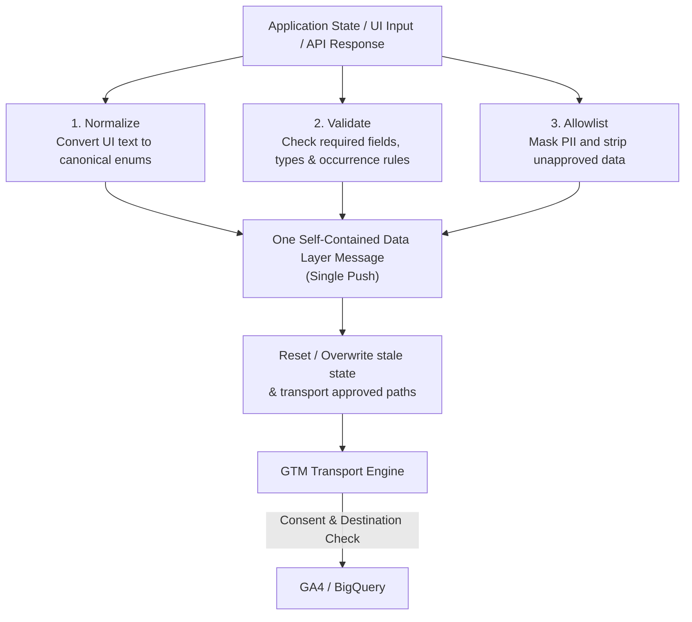

| ALWAYS Include in Data Layer Message                     | STRICTLY Keep Out of Payload                                 |
| -------------------------------------------------------- | ------------------------------------------------------------ |
| event, event_schema_version                              | Full form state, UI DOM text, or raw API response body       |
| Application-confirmed business outcome                   | PII (Raw Email, Phone, Name, Address, National ID)           |
| Approved scalar parameters (String, Number, Boolean)     | Authentication tokens, session tokens, passwords, or secrets |
| Stable enums, standardized units, missing-data semantics | Temporary internal flags, React/Vue component internal state |
| Fields strictly required by Event Contract               | Any parameter without an approved business consumer          |

**Lời thoại:**

1. Slide này sẽ định nghĩa ranh giới rõ ràng giữa Code của ứng dụng và GTM: Data Layer chính là một ranh giới Hợp đồng (Contract Boundary). Nguyên tắc rất đơn giản: App nắm giữ sự thật (Business Truth), Data Layer đóng vai trò người vận chuyển (Message), GTM làm nhiệm vụ điều hướng (Routing) và GA4 chịu trách nhiệm Báo cáo. App có thể chứa rất nhiều dữ liệu phức tạp, nhưng Analytics không cần và tuyệt đối không được phép nhận tất cả số dữ liệu thô đó.

2. **[3 bước làm sạch dữ liệu]** Nhìn vào sơ đồ biến đổi dữ liệu, trước khi gọi lệnh dataLayer.push, phía App bắt buộc phải thực hiện 3 bước xử lý:

3. **Normalize (Chuẩn hóa)**: Đổi ngôn ngữ hiển thị trên màn hình thành mã chuẩn (Canonical Enum). Ví dụ: UI hiện chữ 'Xác nhận' thì Data Layer phải gửi mã confirmed, không để GTM tự đoán.

4. **Validate (Xác thực)**: Kiểm tra xem dữ liệu có đúng kiểu, đúng quy tắc và đủ các trường bắt buộc hay chưa.

5. **Allowlist (Lọc an toàn)**: Chỉ giữ lại đúng các trường đã được duyệt trong Event Contract.

6. **[Nguyên tắc Trọn vẹn]** Một Data Layer Message chuẩn phải có tính chất Self-Contained (Tự chứa đủ) — tức là mọi thông tin cần thiết cho event đó phải nằm trọn trong một lần Push duy nhất. Lưu ý: GTM có tính chất hay lưu lại các giá trị cũ (stale state). Nếu lần Push sau bị thiếu trường mà không được xóa sạch, GTM sẽ đọc nhầm dữ liệu của event trước. Vì vậy, mỗi lần Push mới phải vừa mang đủ thông tin, vừa phải ghi đè hoặc làm sạch dữ liệu cũ.

7. **[An toàn Dữ liệu - Do's and Don'ts]** Tiếp theo là bảng quy tắc Do's and Don'ts: Chúng ta chỉ gửi các tham số đơn lẻ (scalar values) đã qua phê duyệt. Những thứ tuyệt đối KHÔNG đưa vào Payload: Email thô, Số điện thoại, Token đăng nhập, Mật khẩu, chữ do người dùng nhập tự do, hay toàn bộ dữ liệu thô trả về từ API.

8. **Cuối cùng là quy tắc đếm**: 1 lần sự kiện thực sự xảy ra chỉ tạo đúng 1 Message. Khi người dùng thực sự bấm chạy lại tính toán, đó là event mới. Nhưng nếu ứng dụng tự vẽ lại màn hình (re-render), tự thử lại khi mất mạng (retry), thì không được phép gửi thêm event trùng lặp.

9. **Tóm lại**, Data Layer không phải là một chiếc thùng rác chứa toàn bộ dữ liệu ứng dụng. Nó là một chiếc phong bì niêm phong chỉ chứa đúng những gì Hợp đồng (Event Contract) cho phép.

### Slide 11 — Data Layer Validation

**Mục tiêu học tập:** dạy team kiểm chứng Data Layer trong các tình huống bất đồng bộ, lỗi, lặp và dữ liệu cũ; không chỉ kiểm tra một happy-path push.

**Slide content (English):**

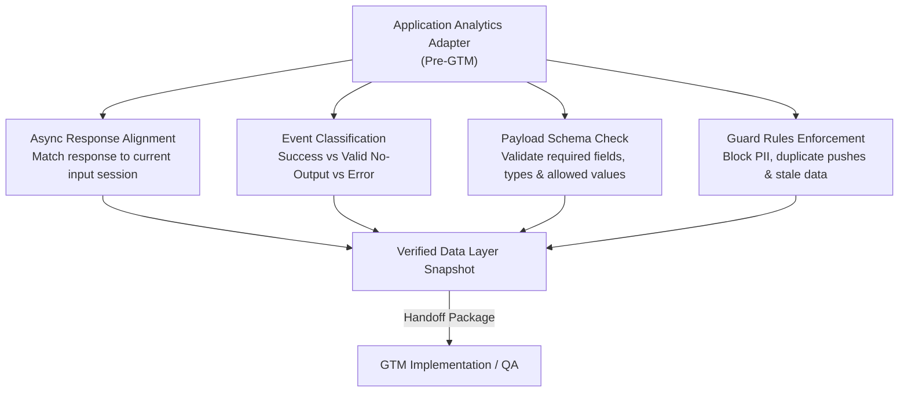

| Scenario            | Validation Question                                  | Expected Behavior                                                 |
| ------------------- | ---------------------------------------------------- | ----------------------------------------------------------------- |
| Success             | Did the app-confirmed outcome occur?                 | Emit exactly 1 message with correct version & approved fields     |
| Valid No-Output     | What if a valid response returns empty results?      | Emit contract-defined no_output event; do NOT treat as failure    |
| API Error / Timeout | Is system failure classified separately?             | Emit contract-defined error event; never misclassify as no-output |
| Invalid Input       | What happens before a valid occurrence exists?       | Block event emission until input passes business validation       |
| Duplicate / Replay  | Does re-rendering or network retry double-count?     | Exactly 1 occurrence = 1 message; suppress duplicate callbacks    |
| Stale Response      | Does an old async response return after a new input? | Drop stale response or classify as stale per contract rules       |
| Missing Field / PII | Is a required field missing or PII present?          | Fail the test if required field is missing; strip/mask any PII    |

**Lời thoại:**

1. Slide này đưa chúng ta đến một bước cực kỳ quan trọng: **Data Layer Validation (Kiểm chứng Data Layer)**. Sai lầm phổ biến nhất của các team là chỉ test trường hợp *Happy Path*. Nhưng trong thực tế, 80% lỗi dữ liệu lại đến từ các thao tác bất đồng bộ, mạng chậm, bấm nút lặp lại, hoặc dữ liệu cũ bị trả về muộn.

2. **[Quy trình Validation]** Nhìn vào sơ đồ biến đổi, việc validation này phải do **Analytics Adapter phía App kiểm tra trước khi bàn giao cho GTM**. GTM Preview chỉ xem được dữ liệu đã đẩy ra, chứ không thể chứng minh logic phía sau App là đúng hay sai.

3. **[Phân biệt kịch bản test]** Nhìn vào **bảng Scenario Test Matrix**, team QA và Dev bắt buộc phải kiểm tra đủ 7 kịch bản:
   * **1. Success vs Valid No-Output:** Cần phân biệt rõ: Nếu user chạy tính toán và API trả về 'không tìm thấy kết quả', đó là *Valid No-Output* (kết quả rỗng hợp lệ), không phải là lỗi hệ thống.
   * **2. API Error & Timeout:** Ngược lại, nếu mạng bị timeout hay Server sập, bắt buộc phải phát event `error` riêng, tuyệt đối không gom chung vào nhóm 'không có kết quả'.
   * **3. Invalid Input:** User nhập sai định dạng hoặc chưa bấm xong mà hệ thống đã phát event là sai rule.
   * **4. Duplicate & Stale Response:** Khi user bấm nút liên tục, hoặc một request cũ bất đồng bộ trả về muộn sau khi user đã đổi thông tin mới, Adapter phải biết **loại bỏ dữ liệu cũ (*drop stale response*)** và chống đếm trùng (*deduplicate*).
   * **5. Missing Field & PII Guard:** Nếu thiếu trường bắt buộc, test phải báo Fail. Nếu có PII như Email hay SĐT lọt vào, payload phải bị chặn lại ngay lập tức.

4. **[Hồ sơ bàn giao GTM]** Khi bàn giao cho GTM Engineer, Dev không chỉ đưa tên Event, mà phải đưa kèm một **Handoff Package** gồm: Danh sách Key/Path, Kiểu dữ liệu, Quy tắc thiếu/lỗi, và Bằng chứng Test Snapshot của tất cả các kịch bản trên.

## 7. Variables, Triggers, and Tags — Slides 12–13, 62 to 72 minutes

### Slide 12 — Three GTM Questions

**Mục tiêu học tập:** dạy team hiểu chính xác Variable, Trigger và Tag làm gì, không dùng một loại asset để che trách nhiệm của loại asset khác.

**Slide content (English):**

```text
1. VARIABLE  → "WHICH value do we need?"
   - Evaluates to a single approved data point.
   - Does NOT make business decisions or fire tags.

2. TRIGGER   → "WHEN is the Tag eligible to fire?"
   - Evaluates conditions (Events + Filters + Exceptions).
   - Does NOT send network requests or clean raw data.

3. TAG       → "WHAT action or request is executed?"
   - Maps payload and dispatches to the destination.
   - Does NOT recalculate business logic or validate data layer integrity.

--------------------------------------------------------------------------------
[Tag Firing Logic]
FIRE = (Trigger 1 OR Trigger 2) AND NOT (Exception 1 OR Exception 2)
       AND Consent Allowed AND Sequencing Satisfied

* Trigger Group = WAIT for all member triggers (Order-agnostic)
* Tag Sequencing = FORCE execution order (Does not wait for API responses)
```

| Asset    | Source / Inputs                         | Output                             | Anti-Pattern (What NOT to do)                                  |
| -------- | --------------------------------------- | ---------------------------------- | -------------------------------------------------------------- |
| Variable | Data Layer, URL, Cookie, Lookup Table   | Approved value for mapping/rules   | Scrape DOM text when Application Data Layer exists             |
| Trigger  | Event name, Filters, Exceptions, Timing | Firing state (Eligible / Blocked)  | Use broad Click / DOM Element triggers for Success Outcomes    |
| Tag      | Event, Variables, Consent, Destination  | Network request / Action execution | Write JS in Tag to fix bad data or recalculate business values |


**Lời thoại:**

1. ở Slide này chúng ta sẽ làm rõ tư duy quản trị GTM cơ bản nhất nhưng lại rất hay bị làm sai: Phân định trách nhiệm giữa Variable, Trigger và Tag.

2. Một sai lầm phổ biến khi triển khai GTM là lấy chức năng của asset này che lấp cho lỗi của asset khác. Để chuẩn hóa, team mình cần thuộc 3 câu hỏi sau:

3. **Variable** — WHICH value do we need?

4. Variable có nhiệm vụ duy nhất: Trả về một giá trị đã qua kiểm duyệt (approved value). Nó đọc từ Data Layer, Cookie hoặc URL. Nó không quyết định event có thành công hay không, và không tự gửi dữ liệu.

5. **Trigger** — WHEN is the Tag eligible to fire?

6. Trigger quy định thời điểm Tag đủ điều kiện chạy dựa trên Event, Filter và Exception. Trigger kiểm tra điều kiện chứ không tự phát network request.

7. **Tag** — WHAT action is executed?

8. Tag đóng gói dữ liệu từ Variable và gửi request sang GA4, Meta, hay Server-side. Tag không có nhiệm vụ đi tính toán lại logic kinh doanh của ứng dụng.

9. Về **công thức Firing Logic** trên Slide:

10. Các Trigger khác nhau gắn vào cùng 1 Tag sẽ chạy theo logic OR (chỉ cần 1 cái thỏa mãn là đủ).

11. Các điều kiện Filter bên trong 1 Trigger chạy theo logic AND (phải thỏa mãn tất cả).

12. Exception luôn thắng: Nếu dính Exception, Tag dừng ngay lập tức.

13. Phân biệt nhanh giữa **Trigger Group** và **Tag Sequencing**:

14. **Trigger Group** là cổng chờ: Nó bắt TẤT CẢ Trigger thành viên phải xảy ra thì mới nhả Tag, nhưng không quan tâm thứ tự cái nào trước cái nào.

15. **Tag Sequencing** quản lý thứ tự thực thi giữa các Tag phụ thuộc. Lưu ý: Nó chỉ kích hoạt Tag tiếp theo chứ không chờ API response trả về, và cũng không tự tạo ra dữ liệu thiếu cho Data Layer.

16. **3 Nguyên tắc cốt lõi** (Anti-patterns) team cần lưu ý:

17. **Dùng Custom Event thay vì Click/DOM cho Business Outcome:** Click chỉ biểu thị intent (ý định) của user, không biểu thị outcome (kết quả). Với các sự kiện quan trọng như 'Sign up success', 'Payment complete', bắt buộc dùng Custom Event do backend/app push vào Data Layer. Không dùng Click/DOM Element Trigger trừ khi chính UI action đó là cái chúng ta cần đo.

18. **Tư duy Fail-Closed khi Data bị lỗi**: Nếu Variable quan trọng bị thiếu hoặc sai contract schema, thà để Trigger không match (Tag không fire) để QA phát hiện ra bug, còn hơn viết thêm Custom JavaScript hack/patch trên GTM để gán giá trị unknown hay fallback. Đừng dùng GTM để 'che lỗi' cho App Data Layer.

19. **Thứ tự ưu tiên nguồn Data (Native-first):**

20. Luôn ưu tiên dữ liệu Application Data Layer chuẩn. Chỉ dùng DOM Scraping hoặc Custom JS Variable làm giải pháp cuối cùng (Last Resort) khi không thể can thiệp code, và phải có sự phê duyệt từ QA về rủi ro vỡ layout."

21. Ví dụ, một Trigger `calculation_action` có thể yêu cầu đúng event name, đúng schema version và đúng environment. Nếu field `solution_found` sai, không nên thêm JavaScript vào Trigger để “sửa” business meaning; hãy sửa Application hoặc Data Layer contract. Nếu required Variable bị thiếu hoặc invalid, phải fail closed: Trigger không match, Tag không fire và QA ghi nhận contract defect; không dùng fallback rộng hoặc `unknown` để che lỗi. Nếu Trigger match nhưng request không đi, kiểm tra consent, exception, tag settings và destination thay vì kết luận event không tồn tại.

### Slide 13 — Managing GTM Assets

**Mục tiêu học tập:** dạy team quản lý Variable, Trigger và Tag như các asset có contract, owner, lifecycle và evidence; không tạo cấu hình rời rạc theo từng ticket.

**Slide content (English):**

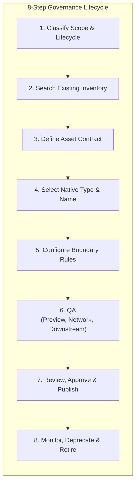

**Minimum asset contract:**


| Section | Required Attributes |
| ------- | ------------------- |
| Identity & Purpose | Asset Type, Naming, Purpose, Scope, Contract Version |
| Source & Inputs | Source System, Exact Event/Action, Variable Mapping |
| Firing Governance | Authoritative Trigger, Filters, Exceptions, Consent |
| Environment & Target | Target Environment, Destination/Stream, Expected Count |
| Ownership & QA | Owner, Consumers, Evidence/QA Spec, Retirement Criteria |

**Lời thoại:**

1. Một sai lầm rất lớn của các team analytics là làm việc theo kiểu 'có ticket thì tạo asset mới'. Việc này biến GTM thành một 'bãi rác kỹ thuật' (technical debt), rất khó bảo trì và dễ vỡ hệ thống khi app cập nhật. Từ hôm nay, mọi Variable, Trigger hay Tag chúng ta tạo ra đều phải có Owner, Lifecycle, Contract và QA Evidence rõ ràng.

2. Để làm được điều đó, chúng ta sẽ tuân theo quy trình 8 bước được thể hiện ở phần trên slide. Mọi người lưu ý ở Bước 2 (Search Existing Inventory):
   * Không phải cứ thấy một Asset 'đã có sẵn' trong GTM là chúng ta bấm dùng lại (reuse) ngay lập tức. Ta chỉ được reuse khi các yếu tố như: Data source, Scope, Consent, Environment, Destination và Business Moment hoàn toàn khớp nhau.
   * Ví dụ: Hai nút trên màn hình có thể cùng bắn chung một event tên là click_button, nhưng nếu một nút là Submit Lead còn một nút là Download Brochre, chúng là 2 Business Moments hoàn toàn khác nhau! Đừng bao giờ gom chung một Trigger chỉ để 'tiết kiệm' số lượng asset trên GTM.

3. **Minimum Asset Contract** — đây là 'chứng minh thư' bắt buộc của mỗi Asset trước khi được tạo trên GTM. Khung này giúp người review hoặc QA trả lời nhanh 5 nhóm câu hỏi:
   * Identity & Purpose: Asset này tên gì, tạo ra để làm gì, thuộc scope nào?
   * Source & Inputs: Nó đọc dữ liệu từ đâu? Lấy Event name hay Variable nào?
   * Firing Governance: Trigger chuẩn của nó là gì? Có bị chặn bởi Consent hay Exception nào không?
   * Environment & Target: Nó đẩy dữ liệu đi đâu (GA4, Meta, Server-side)? Tần suất bắn dự kiến (Expected Count) là bao nhiêu?
   * Ownership & QA: Ai chịu trách nhiệm (Owner), ai tiêu thụ dữ liệu này (Consumer), bằng chứng QA nằm ở đâu, và khi nào thì xóa nó (Retirement)?

4. Về mặt kỹ thuật triển khai, team bắt buộc tuân thủ nguyên tắc Native-First:
   * Ưu tiên 100% sử dụng các thẻ, biến và trigger có sẵn (native) của GTM.
   * Các giải pháp như Custom JavaScript, DOM Scraping hay Custom Template chỉ được dùng làm phương án cuối cùng (Last Resort).
   * Khi bắt buộc phải xài Custom JS/DOM, bạn phải giải thích trong Contract: Tại sao Native không đáp ứng được? Risk là gì? Đã test kỹ khả năng vỡ layout khi Dev đổi code UI chưa?

5. Quy chuẩn Naming & Quản lý Thư mục
   * Quy chuẩn đặt tên (Naming convention) và sắp xếp Folder không phải để cho đẹp mắt, mà là để quản lý rủi ro.
   * Tên của Asset (Canonical Name) phải giúp bất kỳ ai nhìn vô cũng hiểu ngay: Asset này thuộc Event nào, dùng cho Consumer nào (GA4, Ads hay CRM) và ở Scope nào, mà không cần mở chi tiết cấu hình bên trong ra xem.

6. Quy trình QA & Publishing: Trước khi bấm Publish, quy trình QA của chúng ta gồm 3 cấp độ:
   * Preview Mode: Kiểm tra xem Trigger có match và Variable có lấy đúng giá trị trên giao diện không.
   * Network Tab: Kiểm tra xem Network Request gửi đi có đúng Payload, đúng Endpoint và HTTP Status 200 không.
   * Downstream Check: Kiểm tra xem dữ liệu có đổ về đúng DebugView của GA4 hay BigQuery/Database hệ thống chưa.
   * Bên cạnh đó, mỗi dự án phải tuân thủ đúng phân quyền của GTM Container (đặc biệt nếu dùng GTM 360 có tính năng Workspaces & Approval Workflow) để đảm bảo không ai được tự ý publish bản draft chưa qua review.

7. Vòng đời Asset sau khi Publish (Deprecation & Retirement)
   * Mọi Asset phải được theo dõi (Monitor). Nếu ứng dụng thay đổi Data Layer, Asset phải được đánh giá lại. Nếu một báo cáo không còn dùng đến một chỉ số nữa, ta không được nhảy vào xóa Asset đó ngay lập tức!
   * Ta phải chuyển nó sang trạng thái Deprecate (Cảnh báo ngừng sử dụng) để thông báo cho các bên liên quan (Downstream team). Sau một thời gian xác nhận không còn ai phụ thuộc vào Asset đó nữa, ta mới chính thức Retire (Xóa bỏ hẳn). Điều này giúp ngăn chặn hoàn toàn rủi ro xóa nhầm làm vỡ hệ thống đo lường của các team khác."

## 8. Consent and Template Governance — Slide 14, 72 to 80 minutes

**Mục tiêu học tập:** dạy team coi consent là một permission boundary độc lập với event logic, hiểu sự khác nhau giữa basic và advanced behavior, và biết khi nào custom template là ngoại lệ cần governance.

**Slide content (English):**

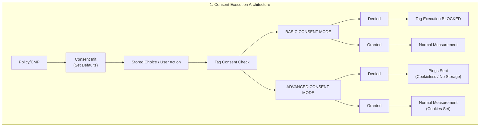


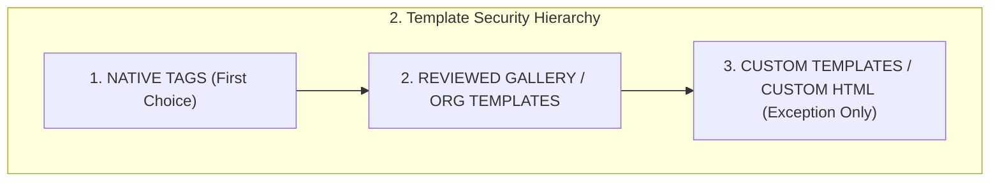

[3.  Consent Verification Matrix]

|Consent State / Event | Mandatory Verification Behavior |
| ---| --- |
| Not Set / Unknown / Delay | Fail-safe enforcement: MUST NOT treat as Granted. Block or default to Policy Fail-safe. |
| Granted                  | Verify tag purpose, storage permissions, and target destination compliance. |
| Denied (Basic Mode)      | Verify complete suppression of network requests and storage access. |
| Denied (Advanced Mode)   | Verify cookieless pings ONLY; confirm no client-side storage (`_ga`, `_gid`) is accessed/read. |
| Stored Choice / Return   | Verify CMP applies stored state BEFORE any dependent measurement tags attempt execution. |
| Update / Revocation      | Verify real-time application; updates MUST NOT retroactively validate prior unauthorized tags. |

**Lời thoại:**

1. ở Slide này chúng ta đến với một chủ đề mà nếu làm sai, không chỉ hỏng dữ liệu mà doanh nghiệp còn đối mặt với rủi ro pháp lý vô cùng nghiêm trọng: Consent và Template Governance.
   * Consent không phải là một điều kiện Trigger phụ. Consent là một 'Permission Boundary' (Ranh giới cấp phép) độc lập hoàn toàn với business logic. Việc Data Layer xuất hiện event chỉ chứng minh App đã đẩy dữ liệu; nó không đồng nghĩa với việc GTM được phép thu thập dữ liệu đó nếu người dùng chưa đồng ý.

2. Vòng đời của Consent bắt đầu ngay khi trang web tải lên (Consent Initialization):
   * CMP (Consent Management Platform) phải thiết lập trạng thái mặc định (Default State) ngay lập tức — với GA4 thường bắt đầu bằng analytics_storage.
   * Nếu là khách hàng cũ quay lại, trạng thái đã lưu (Stored Choice) phải được áp dụng trước khi bất kỳ Tag đo lường nào kích hoạt.
   * Quy tắc vàng: 'Not set' hoặc 'Unknown' KHÔNG ĐƯỢC COI LÀ Granted!
   * Nếu CMP bị chậm, bị lỗi script, hoặc người dùng chưa chọn: Ta bắt buộc phải Fail-Safe (mặc định là Denied). Tuyệt đối không được có tư duy 'cho chạy tạm để tránh mất data' nếu chưa có sự phê duyệt từ bộ phận Pháp lý/Privacy Owner."

3. Phân biệt Basic Consent Mode vs Advanced Consent Mode
   * Basic Consent Mode: Đúng nghĩa 'Bật/Tắt'. Khi người dùng Refuse, Tag của Google bị chặn hoàn toàn (Blocked), không có bất kỳ network request nào gửi đi.
   * Advanced Consent Mode: Cho phép gửi các tín hiệu Cookieless Pings (không đọc/ghi cookie hay storage) ngay cả khi bị Denied, phục vụ cho việc Modeling data sau này của Google.
   * Do đó, khi QA, team không chỉ nhìn xem Banner có hiện hay không, mà phải mở Network Tab và Application Storage ra kiểm tra: Đã Denied rồi thì cookie _ga có bị đọc/ghi lén hay không?"

4. Về mặt thời gian áp dụng Consent (Timing):
   * Khi người dùng thay đổi quyết định (ví dụ: bấm Rút lại đồng ý - Revoke Consent): Sự thay đổi này phải có hiệu lực ngay lập tức cho các tag về sau.
   * Lưu ý quan trọng: Một thao tác 'Grant consent' ở phút thứ 5 không thể biến các tag đã chạy vi phạm ở phút thứ 1 thành hợp lệ. Data bị thu thập trái phép trước đó vẫn là vi phạm.

5. Quản trị Template: Phân cấp ưu tiên
   * Việc lạm dụng thẻ Custom HTML hay Custom JS chính là con đường ngắn nhất dẫn đến lỗ hổng bảo mật và vi phạm Consent. Chúng ta áp dụng phân cấp ưu tiên bắt buộc sau:
   * **Mức 1** (Ưu tiên tuyệt đối): Dùng Thẻ Native (GA4 Event Tag, Google Tag). Các thẻ này đã tích hợp sẵn Built-in Consent Checks.
   * **Mức 2**: Dùng Custom Template từ Community Gallery đã qua kiểm duyệt hoặc do chính Org phát triển.
   * **Mức 3** (Cực kỳ hạn chế): Custom Template tự viết hoặc Custom HTML/JS.

6. Sự khác biệt giữa Template và Configured Instance
   * Team phát triển cần phân biệt rõ:
   * Template là 'khuôn đúc' (Component Type).
   * Tag/Variable là 'sản phẩm đúc ra' (Configured Instance).
   * Nếu bạn chỉnh sửa code bên trong 1 Template, tất cả các Tag đang dùng Template đó trên toàn bộ Container sẽ bị ảnh hưởng theo. Do đó, không ai được tự ý sửa Template gốc nếu không có sự quản lý phiên bản (Versioning) và quy trình Code Review.

7. Tiêu chuẩn tối thiểu khi tạo Custom Template
   * Trong trường hợp bất khả kháng phải tạo Custom Template, bạn phải nộp một Governance Record đáp ứng đủ các tiêu chuẩn:
   * **Minimum Permissions**: Chỉ xin đúng quyền cần thiết (ví dụ: chỉ đọc Variable X, không xin quyền đọc toàn bộ DOM).
   * **Endpoint Allowlist**: Khai báo chính xác domain mà Template này được phép gửi dữ liệu tới.
   * **Automated Test Cases**: Phải có unit test cho các trường hợp: Success, Failure, Timeout và Retry.
   * **Rollback Plan**: Kế hoạch hạ cấp/quay xe nếu Template bị lỗi trên Production.

8. Cấm đoán hành vi Bypass Consent bằng Custom Code
   * TUYỆT ĐỐI KHÔNG dùng Custom HTML, Custom JavaScript hay Exception Trigger mẹo để lách luật Consent, sửa nghĩa logic kinh doanh hay lách đường truyền dữ liệu.
   * Bất kỳ giải pháp Custom nào đòi hỏi cấp quyền rộng hơn mức Native đều được coi là Rủi ro An ninh & Pháp lý. Nó bắt buộc phải được bóc tách rủi ro và trình ký lên Privacy Owner / Technical Lead trước khi có kế hoạch Release.

## 9. Debugging and Analytics QA — Slides 15–16, 80 to 90 minutes

### Slide 15 — Test Run and Validation Chain

**Mục tiêu học tập:** dạy team thiết kế một Test Run có thể lặp lại, an toàn dữ liệu, đủ scenario và đủ evidence để chứng minh từng handoff thay vì chỉ chụp một màn hình Tag fired.

**Slide content (English):**

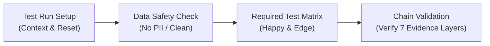

|Evidence Layer   | WHAT IT PROVES                         | WHAT IT DOES NOT PROVE                 |
| --- | --- | --- |
|1 | Application | Valid business logic occurrence | Data Layer push, Consent, or Request |
|2 | Data Layer | Approved contract schema was published | Consent authorization or Request send |
|3 | Consent State | Policy compliance for tested state | Business validity or Correct payload |
|4 | GTM Preview | Logic/Variable/Tag evaluation in test | Production routing or Processed data |
|5 | Network Tab | Actual HTTP Request, Payload & Count | Final Report processing & readiness |
|6 | GA4 DebugView | Downstream ingestion at property level | Final aggregated report aggregation |
|7 | Final Report | Field usability in Exploration/Looker | Upstream root-cause identification |

**Lời thoại:**

1. Mở đầu & Giải thích cấu trúc 4 bước
   * Nhìn tổng quan, quy trình này gồm 4 bước vận hành thực tế mà QA và Dev sẽ đi qua:
   * Bước 1: Test Run Setup (Thừa hưởng context)
   * Bước 2: Data Safety Check (An toàn dữ liệu)
   * Bước 3: Required Test Matrix (Xây dựng kịch bản test)
   * Bước 4: Chain Validation (Xác minh chuỗi bằng chứng 7 tầng)

2. Bước 1 - Test Run Setup: Một buổi test chuẩn phải ghi nhận đủ thông tin: Run ID, Commit/Build, Environment, Browser và đặc biệt là Phương pháp Reset (xóa Cookie, clear Storage, clear Network Log). Nếu không reset sạch trước khi test lại, kết quả sẽ bị sai lệch.

3. Bước 2 - Data Safety Check: Trước khi bấm test, bắt buộc kiểm tra:
   * Chỉ dùng Synthetic Data (Dữ liệu giả lập), tuyệt đối không dùng Email hay SĐT thật (PII).
   * Đảm bảo request trỏ về Staging/Test Stream, không để dữ liệu test chảy làm bẩn Production Property.

4. Bước 3 - Required Test Matrix: Một quy trình test không chỉ chạy cho xong trường hợp thành công (Happy Path), mà phải cover các Edge Cases / Negative Cases:
   * Test khi dữ liệu thiếu field bắt buộc thì Trigger có tự chặn lại (Fail-Closed) không?
   * Test khi Consent bị Denied hoặc CMP script bị chậm.
   * Test trên Single Page App (SPA) khi người dùng chuyển trang không reload.
   * Test bấm nút liên tục (Spam clicks) xem có bị lặp request không.

5. Bước 4 - Chain Validation: Đây là bước quan trọng nhất và cũng là lý do tại sao bảng bên dưới lại có 7 tầng bằng chứng (Evidence Layers).
   * Sai lầm lớn nhất trước đây của team là: Thấy Tag báo 'Fired' trong GTM Preview ➔ Chụp 1 tấm ảnh ➔ Báo xong.
   * Bức ảnh đó không chứng minh được dữ liệu có tới được GA4 hay không. Vì vậy ở Bước 4 này, status 'PASS' chỉ được công nhận khi dữ liệu đi qua trơn tru đủ 7 tầng bằng chứng.

6. Mỗi tầng bằng chứng có một giá trị chứng minh riêng và không thể thay thế cho nhau:
   * Tầng 1 (App) & Tầng 2 (Data Layer): Chứng minh logic ứng dụng đúng và schema đã đẩy ra Data Layer. Nhưng chưa chứng minh Tag được phép chạy.
   * Tầng 3 (Consent) & Tầng 4 (GTM Preview): Chứng minh logic đúng quy định Privacy và Trigger match trong môi trường Test. Nhưng chưa chứng minh request thực tế đã gửi đi.
   * Tầng 5 (Network Tab): Bằng chứng sống còn! Chứng minh HTTP Request đã rời trình duyệt, đúng Endpoint và Payload. Nhưng chưa chứng minh GA4 đã xử lý xong.
   * Tầng 6 (GA4 DebugView) & Tầng 7 (Processed Report): Chứng minh GA4 đã nhận và hiển thị được trên báo cáo.
   * Nếu báo cáo ở Tầng 7 bị sai, bạn không thể suy đoán mò, mà phải tra ngược lại từ Tầng 1 đến Tầng 6 để tìm xem đứt gãy ở đâu.

7. Tóm lại, quy trình QA của team từ hôm nay gói gọn trong 4 Bước thực thi. Tại Bước 4, chỉ khi nào bạn nối liền được bằng chứng từ: [App ➔ Data Layer ➔ GTM Preview ➔ Network 200 ➔ GA4 DebugView], ticket đó mới chính thức được tính là hoàn thành!

### Slide 16 — Diagnose by the First Failing Layer

**Mục tiêu học tập:** dạy team tìm layer đầu tiên có bằng chứng sai, giao đúng owner và retest theo cùng boundary; không chữa symptom ở downstream.

**Slide content (English):**

**4-Step Diagnostic Protocol:**

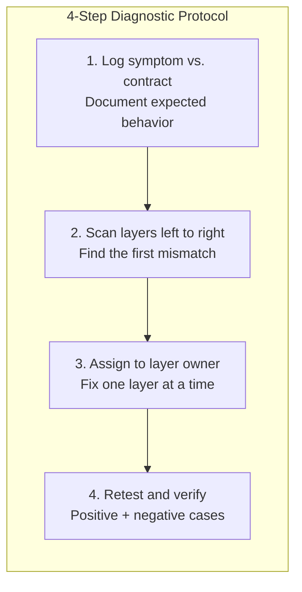

**Diagnostic Matrix:**

| Observed Symptom                     | First Failing Layer / Owner   | Next Evidence to Inspect                                   |
| ------------------------------------ | ----------------------------- | ---------------------------------------------------------- |
| No Data Layer message                | Application / Dev Team        | App code, Business state, Callback logs, Push timeline     |
| Data Layer event present, No Tag     | GTM Configuration             | Exact Event Name, Trigger Filters, Variables, Exceptions   |
| Schema or Field value incorrect      | Event Contract / App          | Data Layer snapshot, Schema version, Type/Value check      |
| Tag fires, but NO Network Request    | GTM / Browser / Consent       | Google Tag config, Consent state, AdBlocker, Tag Error log |
| Wrong Destination / Measurement ID   | Routing / Environment         | Hostname, Request URL, Measurement ID, Container Env      |
| Incorrect Parameter Payload          | Data Contract / GTM           | Variable Data Layer Path, Timing, Type conversion, Payload |
| Duplicate Requests (2x for 1 action) | App Push / GTM Tag            | Push timeline, Overlapping Triggers, SPA Remount/Retry     |
| Request Sent, but DebugView Empty    | GA4 Setup / Environment       | GA4 Property ID, Debug Mode flag, Timestamp, Privacy delay |
| DebugView Valid, but Report Missing  | GA4 Processing / Definition   | Processing window (24-48h), Custom Dimension scope, Filter |

* Rule: NEVER patch symptoms downstream. Fix the root cause at the FIRST failing layer.

**Lời thoại:**

1. Mở đầu & Khái niệm "First Failing Layer"
   * ở Slide này chúng ta sẽ cùng học phương pháp chẩn đoán và sửa lỗi dữ liệu theo nguyên tắc: First Failing Layer (Tầng Lỗi Đầu Tiên).
   * Hãy nhớ: 'First Failing Layer' là tầng đầu tiên mà dữ liệu thực tế không còn khớp với Contract, chứ không phải là nơi cuối cùng khách hàng hay sếp nhìn thấy lỗi.
   * Tức là nếu Báo cáo GA4 bị thiếu số, ta không nhảy vào GA4 hay GTM để 'chữa cháy' ngay lập tức. Ta phải dò ngược lại để xem lỗi bắt đầu đứt gãy từ đâu: do App không push Data Layer? Do Trigger sai? Hay do Consent bị chặn?

2. Quy trình 4 bước chẩn đoán Root-Cause: Khi phát sinh sự cố dữ liệu, cả team sẽ tuân thủ đúng Quy trình 4 Bước ở phần đầu slide:
   * Bước 1: Ghi nhận triệu chứng lỗi (Symptom) và đối chiếu với Event Contract ban đầu xem hành vi đúng phải là gì.
   * Bước 2: Mở DevTools/Preview, quét bằng chứng từ Trái qua Phải (từ App ➔ Data Layer ➔ GTM ➔ Network ➔ GA4) để tìm đúng mismatch đầu tiên.
   * Bước 3: Giao đúng Ticket/Defect cho Owner của tầng lỗi đó. Nguyên tắc: Mỗi lần sửa chỉ sửa đúng 1 tầng để kiểm soát chính xác nguyên nhân.
   * Bước 4: Retest lại kịch bản lỗi và các kịch bản liên quan (Regression Testing) trước khi đóng Ticket.

3. Tra cứu lỗi Tầng 1 & Tầng 2 (App & Data Layer)
   * Triệu chứng: Không thấy Data Layer Message xuất hiện ➔ Tầng lỗi đầu tiên là Application / Dev Team. Đừng cố tạo Trigger Click/DOM trên GTM để thay thế! Hãy giao ticket cho Dev kiểm tra lại App code, Callback hoặc logic Push event.
   * Triệu chứng: Data Layer có Push Event, nhưng Tag không Fire.
   ➔ Tầng lỗi nằm ở GTM Configuration. Bằng chứng tiếp theo cần soi là: Tên Event có bị gõ sai chính tả không? Filter của Trigger có bị lệch không? Hay Variable/Exception nào đang âm thầm chặn Tag?
   * Triệu chứng: Schema hoặc Value bị sai (Ví dụ: price trả về String thay vì Number) ➔ Tầng lỗi thuộc về Data Contract / App. Tuyệt đối không viết Custom JS trên GTM để ép kiểu dữ liệu 'sửa sai' cho App. Hãy trả ticket về cho Dev sửa đúng Contract tại nguồn!

4. Tra cứu lỗi Tầng 3 & Tầng 4 (GTM Execution & Network)
   * Triệu chứng: Tag báo Fired trong GTM, nhưng Network Tab KHÔNG CÓ Request ➔ Tầng lỗi ở GTM / Browser / Consent Mode. Bằng chứng cần kiểm tra: Cấu hình Google Tag, Consent bị Denied, trình duyệt bật AdBlocker, hoặc Tag bị lỗi JavaScript runtime.
   * Triệu chứng: Request có gửi đi, nhưng sai Destination hoặc Measurement ID ➔ Tầng lỗi thuộc về Routing / Environment Owner. Kiểm tra lại Hostname, Request URL, xem có đang trỏ lộn Stream ID của Staging sang Production hay không.
   * Triệu chứng: Request gửi đi đúng, nhưng Parameter Payload bên trong bị thiếu/sai ➔ Tầng lỗi ở GTM Variable Path hoặc Timing. Kiểm tra xem Variable Data Layer có trỏ đúng đường dẫn không, hay Tag bị fire quá sớm trước khi Variable kịp đọc giá trị.

5. Tra cứu lỗi Lặp Request & Hạn chế Hạ nguồn (Layers 5 - 7)
   * Triệu chứng: Thực hiện 1 thao tác nhưng lại bắn ra 2 Request (Duplicate) ➔ Tầng lỗi ở App Push hoặc GTM Trigger. Bằng chứng cần xem: Dev có lỡ push event 2 lần không? Trình duyệt có bị Remount/Retry khi SPA chuyên trang không? Hay có 2 Tag trùng lặp đang cùng lắng nghe 1 Trigger?
   * Triệu chứng: Network báo Request 200, nhưng GA4 DebugView trống rỗng ➔ Tầng lỗi ở GA4 Setup / Environment. Kiểm tra xem có gõ lộn GA4 Property ID không? Flag debug_mode đã bật chưa? Hay do thiết bị bị delay tín hiệu Privacy?
   * Triệu chứng: DebugView nhận đúng, nhưng Báo cáo Bảng (Report/Exploration) không có số ➔ Tầng lỗi ở GA4 Processing / Custom Definition. Lưu ý: GA4 cần 24 - 48 giờ để xử lý data tổng hợp! Hãy kiểm tra xem Custom Dimension đã đăng ký Scope (Event/User) đúng chưa, hay có Filter/Thresholding nào đang giấu dữ liệu đi không.

6. Các Quy tắc Cấm (Anti-Patterns)
  * CẤM dùng Custom JavaScript hoặc Exception 'mù' để bịt mắt cho một lỗi không rõ nguyên nhân.
   * CẤM sửa chữa ở tầng hạ nguồn nếu nguyên nhân gốc nằm ở tầng thượng nguồn. (Ví dụ: Sửa báo cáo Looker Studio để bù số cho lỗi Data Layer).
   * Các giải pháp tạm thời (Workaround) chỉ được phép tồn tại khi: Được ghi rõ trong văn bản, có Owner chịu trách nhiệm, có thời hạn hết hạn (Expiry Date), và KHÔNG ĐƯỢC che giấu lỗi kinh doanh.
   * Mọi sửa đổi sau khi hoàn tất bắt buộc phải có bằng chứng kiểm thử thành công cho cả Happy Path (Positive) và Negative Cases (Negative).

## 10. Reports, Release, and Monitoring — Slide 17, 90 to 98 minutes

**Mục tiêu học tập:** dạy team biết khi nào dữ liệu đủ sẵn sàng để trả lời một câu hỏi trên Report/Exploration, và biết cách đưa một thay đổi đã QA vào production rồi theo dõi sau release.

**Slide content (English):**

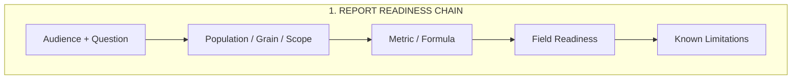

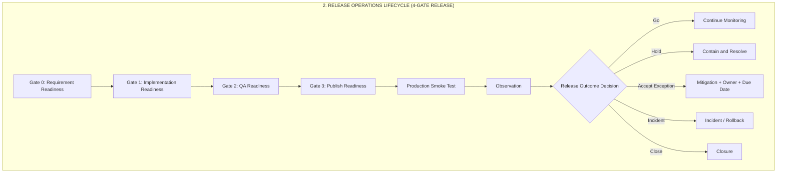

| What seems "Ready"                       | What is ACTUALLY Required for Report-Ready Status                                  |
| ----------------------------------------- | ---------------------------------------------------------------------------------- |
| A parameter appears in Network tab       | Approved business meaning, valid scope, and registered Custom Definition          |
| An event appears in GA4 DebugView        | Field/metric verified and usable on the target GA4 Surface/Exploration             |
| Two numbers appear together in a Report  | Identical population, grain, identity, date range, and calculation formula         |
| GTM Container has been Published         | Baseline verified, QA passed, Smoke test complete, and Monitoring active           |

* Rule: Publishing GTM is NOT the end. A Release is closed ONLY after Post-Publish Monitoring & Outcome Sign-off.

1. Mở đầu & Tư duy "Report-Ready"
   * Nhầm lẫn phổ biến nhất của các team vận hành là: Thấy Tag được Publish trên GTM ➔ Báo với team Business là dữ liệu đã sẵn sàng để xem báo cáo.
   * Đứng ở góc độ quản trị, Publish GTM mới chỉ là 50% quãng đường! Một chỉ số chỉ thực sự 'Report-Ready' khi nó vượt qua các yêu cầu về: Business Meaning, Scope, Processing Window và Data Grain. Bảng so sánh bên dưới slide chính là thước đo bắt buộc cho điều này."

2. Chuỗi Tiêu chuẩn Báo cáo (Report Readiness Chain): Để dựng một Báo cáo chuẩn, chúng ta không tự ý 'đoán' ý nghĩa dữ liệu. Ta phải chốt từ:
   * **Audience & Question**: Ai là người đọc và họ cần trả lời câu hỏi kinh doanh nào?
   * **Population & Grain**: Đối tượng đo lường là toàn bộ user hay chỉ user đã login? Đơn vị đếm (Grain) là User Count, Session Count hay Event Count?
   * **Formula**: Công thức tính Tỷ lệ chuyển đổi (Conversion Rate) là gì? (Lưu ý: Tuyệt đối không lấy Event Count làm Tử số rồi chia cho User Count làm Mẫu số nếu không có lý do có chủ đích!)
   * **Field Readiness**: Field đó đã đăng ký Custom Dimension/Metric trên GA4 UI chưa? Có bị Data Thresholding hoặc Cardinality quá cao làm hạn chế khả năng phân tích hay không?
      * **Cardinality** là số lượng giá trị khác nhau của một dimension. Ví dụ, `method = email/google` có cardinality thấp (= 2) và dễ phân tích; `event_id`, timestamp hoặc user ID có cardinality rất cao, khiến báo cáo dễ gom vào `(other)` hoặc khó tạo breakdown có ý nghĩa.
      * **Data Thresholding** là cơ chế GA4 hạn chế hoặc ẩn dữ liệu khi nhóm người dùng quá nhỏ hoặc có tính nhạy cảm. Ví dụ, event vẫn xuất hiện trong DebugView nhưng một Report theo một nhóm audience rất nhỏ hiển thị thiếu hoặc trống; điều đó không tự chứng minh rằng event không được thu thập.

3. Phân biệt Báo cáo Quản trị (Report) và Báo cáo Khám phá (Exploration)
   * **Standard Report**: Là tài sản được quản trị nghiêm ngặt (Governed Asset), phục vụ các câu hỏi kinh doanh cố định, cần có Owner chịu trách nhiệm bảo trì.
   * **Exploration**: Là 'sân chơi' linh hoạt để Analyst tìm tòi, đào sâu dữ liệu hoặc thử nghiệm câu hỏi mới.
   * Một biểu đồ Path Exploration có thể cho thấy chuỗi hành vi người dùng, nhưng không tự chứng minh mối quan hệ nguyên nhân - kết quả (Causation). Nếu GA4 UI không hỗ trợ công thức tính DISTINCT USER phức tạp, ta phải xuất data ra BigQuery để tính toán theo đúng policy chứ không được tự ý sửa mẫu số trên báo cáo UI.

4. Quy trình Release Operations & 4 Cổng Kiểm soát (Gates)
  * **Gate 0 (Requirement Readiness)**: Yêu cầu kinh doanh và Event Contract đã chốt xong chưa?
  * **Gate 1 (Implementation Readiness)**: Dev và Analytics Engineer đã cấu hình xong Workspace chưa?
  * **Gate 2 (QA Readiness)**: Đã nối đủ Chuỗi Bằng chứng (Validation Chain 7 tầng) ở Slide 15 chưa?
  * **Gate 3 (Publish Readiness)**: Đã có kế hoạch Quay xe (Rollback Plan), Baseline so sánh và phê duyệt từ Approver chưa?
  * **Lưu ý**: Mọi Release Packet phải lưu rõ phiên bản Baseline trước khi Publish để làm căn cứ đối chiếu.

5. Production Smoke Test
   * Ngay sau khi bấm nút Publish GTM, team phải tiến hành Production Smoke Test ngay lập tức bằng các phương pháp an toàn:
   * Sử dụng Synthetic Test Account hoặc IP/Identity nằm trong Allowlist.
   * TUYỆT ĐỐI CẤM tạo đơn hàng thật, bấm thanh toán tiền thật hoặc tạo Key Event giả trên Production chỉ để 'test thử xem tag có fire không' nếu chưa có sự phê duyệt đặc biệt.
   * Nội dung Smoke Test gồm: Xác nhận Hostname, Version Container vừa xuất bản, GA4 Stream ID, Consent state, Network Request status 200 và hiển thị trên DebugView.

6. Post-Release Monitoring
   * Sau khi Smoke Test thành công, hệ thống đi vào giai đoạn Monitoring trong cửa sổ quan sát.
   * Các chỉ số tối thiểu cần đưa vào Dashboard giám sát bao gồm:
     * **Event Volume**: Biểu đồ sản lượng event có bị tụt dốc thảm hại hoặc tăng đột biến không?
     * **Parameter Quality & Missingness**: Tỷ lệ biến bị null, undefined hoặc unknown là bao nhiêu?
     * **Duplicate Rate**: Có bị bắn trùng lặp request không?
     * **Consent Behavior**: Luồng Consent Mode có bị đứt gãy không?
   * **Lưu ý**: Tín hiệu cảnh báo từ Monitoring chỉ là lý do để ta đi điều tra, nó không tự giải thích nguyên nhân gốc.

7. 5 Quyết định Kết quả Release (Release Outcomes)
   * **GO (Thông qua)**: Mọi thứ hoạt động hoàn hảo, đóng Release.
   * **HOLD (Tạm dừng)**: Phát hiện bất thường (routing sai, dữ liệu PII bị lọt, lặp event) ➔ Tạm khoanh vùng để sửa.
   * **ACCEPT EXCEPTION (Chấp nhận Ngoại lệ)**: Cho phép chạy dù có lỗi nhỏ, NHƯNG phải đáp ứng 4 điều kiện: Thứ nhất: Rủi ro khoanh vùng được. Thứ hai: Có Owner chịu trách nhiệm. Thứ ba: Có giải pháp khắc phục (Mitigation Plan). Thứ tư: Có Hạn chót sửa lỗi (Due Date).
   * **INCIDENT / ROLLBACK (Sự cố / Quay xe)**: Xảy ra sự cố nghiêm trọng ➔ Thực hiện Rollback về Version GTM an toàn trước đó.
   * **CLOSE (Chính thức đóng Release)**: Đã hoàn tất đẩy đủ báo cáo, bằng chứng và khắc phục mọi tồn đọng.

8. Rollback
   * Rollback trên GTM chỉ đơn giản là khôi phục lại cấu hình Container về phiên bản an toàn trước đó. Rollback KHÔNG XÓA hay SỬA được các dữ liệu sai đã lỡ gửi về GA4!
   * Nếu lỗi nằm ở code App hay Data Layer của Backend, việc Rollback GTM sẽ không giải quyết được nguyên nhân gốc. Do đó, kỷ luật đi qua 4 Gate kiểm soát từ đầu vẫn là lá chắn an toàn duy nhất của chúng ta!


## 11. Change Request Governance — Slide 18, 98 to 106 minutes

**Mục tiêu học tập:** dạy team biến một yêu cầu thay đổi thành một record có scope, risk, owner, acceptance criteria, approval và traceability đủ để thực thi an toàn.

**Slide content (English):**

```mermaid
flowchart LR
  crInitiation["CR Initiation<br/>(ID & Reason)"] --> scopeRisk["Scope & Risk Scan<br/>(Before / After)"]
  scopeRisk --> designReview["Design Review<br/>(Approval)"]
  designReview --> implementation["Implementation<br/>(Record Update)"]
  implementation --> qaEvidence["QA & Evidence<br/>(Live Baseline)"]
  qaEvidence --> releaseDecision["Release Decision<br/>(Go/Hold/Exception)"]
  releaseDecision --> versionPublish["Version & Publish"]
  versionPublish --> smokeMonitor["Smoke Test & Monitor"]
  smokeMonitor --> closureAssessment["Closure Assessment<br/>(Close / Incident)"]
```

--------------------------------------------------------------------------------
### Minimum CR Standard: The 9 Core Questions

| # | Question the CR Must Answer | Required Record / Evidence |
| ---: | --- | --- |
| 1 | What & Why? | Business question, user journey, change reason |
| 2 | Before/After State & Mode? | Proposed schema, change mode (Runtime vs. Simulation vs. Doc-only) |
| 3 | Who is Accountable? | Requester, Business/Tech/QA Owners, Approver, Implementer |
| 4 | What is in Scope & Affected? | Application build, Hostname, GTM Container, GA4 Stream, Reports |
| 5 | Where is the Risk? | Schema breaking change, Privacy/Consent, Irreversible destination impact |
| 6 | How is Success Measured? | Observable Acceptance Criteria, Expected count, Negative QA test cases |
| 7 | Which Baseline & Deployment Path? | Verified live baseline, migration boundary, deployment path |
| 8 | Which Records Must be Updated? | Ordered updates: Contract → Implementation → QA → Release → Reports |
| 9 | When can it be Approved & Closed? | Design sign-off, Release decision (Go/Hold/Exception), Closure Evidence |

**Lời thoại:**

1. Mở đầu & Vai trò của Change Request (CR)
   * Chúng ta đã học qua từng layer kỹ thuật: từ Data Layer, Variable, Trigger, Tag, Consent cho đến QA và Release. CR chính là hồ sơ pháp lý (Record) nối tất cả các layer đó lại với nhau.
   * Một quy tắc: Không có CR được phê duyệt ➔ KHÔNG BẮT ĐẦU bất kỳ thao tác Runtime Implementation nào trên GTM hay Application code.

2. Vòng đời 6 bước của một Change Request
   * **CR Initiation**: Khởi tạo ID, người yêu cầu và lý do nghiệp vụ.

   * **Scope & Risk Scan**: Xác định chính xác phạm vi ảnh hưởng và quét rủi ro.
   * **Design Review**: Phê duyệt bản thiết kế Event Contract và Schema.
   * **Implementation**: Cấu hình và cập nhật hồ sơ theo thứ tự.
   * **QA & Evidence**: Kiểm thử trên Live Baseline và thu thập bằng chứng 7 tầng.
   * **Release Decision**: Bấm nút Release (Go, Hold, Accept Exception) ➔ Smoke Test ➔ Đánh giá đóng CR (Closure).

3. 9 Câu hỏi bắt buộc một CR phải trả lời
   * **1 & 2. What, Why & Change Mode**: Thay đổi cái gì, vì sao? Trạng thái Before/After là gì? Change Mode là gì (Sửa code Runtime, hay chỉ cập nhật Documentation)?
   * **3. Ownership**: Ai là Requester, ai là Tech Lead, ai là QA, và ai có quyền Approve?
   * **4. Specific Scope**: Scope phải chi tiết đến mức: User Journey nào, Build/Version App nào, Hostname nào, GTM Workspace nào, và GA4 Measurement ID nào? Không chấp nhận ghi scope mơ hồ như 'Update tracking nút bấm'.
   * **5. Risk Assessment**: Rủi ro nằm ở đâu? Có gây breaking change cho schema cũ không? Có ảnh hưởng đến Consent hay Báo cáo lịch sử không?

4. Tiêu chuẩn nghiệm thu (Acceptance Criteria) & Live Baseline
   * **6. Acceptance Criteria**: Yêu cầu nghiệm thu phải đo lường/quan sát được (Observable): Event name đúng, Value type đúng, Request gửi đúng Destination, không dính PII, và các kịch bản phủ định (Negative cases) đều pass. 'Tag đã Fired' không phải là tiêu chuẩn nghiệm thu đầy đủ.
   * **7. Baseline & Deployment Path**: Bạn đang triển khai dựa trên Verified Live Baseline nào? Nếu chưa xác nhận được Baseline thực tế đang chạy trên Production, trạng thái của CR bắt buộc phải ở mức BLOCKED, không được tự suy đoán từ tài liệu cũ!
   * **8 & 9. Order of Updates & Closure**: Các tài liệu (Contract, QA Matrix, Release Note) được cập nhật theo thứ tự nào, và điều kiện nào để chính thức đính tem Closed cho CR?

5. Định nghĩa các Khái niệm Quản trị Cốt lõi (Core Concepts): Để toàn team dùng chung một ngôn ngữ quản trị, chúng ta chốt các định nghĩa sau:
   * **Scope**: Là 'hàng rào' kiểm soát, bao gồm Journey, App Build, Hostname, Container ID, Stream ID và Báo cáo liên quan.
   * **Risk (Low / Medium / High)**: Đánh giá dựa trên mức độ tác động đến việc thu thập dữ liệu, phá vỡ schema (breaking change), rủi ro pháp lý Consent, hoặc các bộ lọc không thể đảo ngược (irreversible filters).
   * **Traceability (Tính truy vết)**: Là khả năng từ một biến trên GTM có thể truy ngược lại ticket Jira nào, CR nào, Event Contract nào và Báo cáo nào đang sử dụng nó.

6. Phân biệt Tài liệu Lifecycle (Document) vs. Thực thi Runtime
   * Một điểm cực kỳ quan trọng team cần phân biệt: Document Lifecycle hoàn toàn khác với Runtime Lifecycle!
   * Một tài liệu Spec có thể đã được phê duyệt (Approved), nhưng trạng thái chạy thực tế dưới App/GTM vẫn có thể là Blocked do chưa xong QA.
   * Một Release đã bấm Publish thành công, nhưng trạng thái dữ liệu trên GA4 Report vẫn có thể ở dạng Processing.
   * Đừng bao giờ đánh đồng việc 'Tài liệu đã duyệt' với việc 'Dữ liệu đã sẵn sàng trên báo cáo'.

7. Phân biệt các Trạng thái Ngoại lệ: Blocked, Pending, Exception: Khi CR gặp sự cố, team sử dụng đúng thuật ngữ trạng thái
   * **Blocked**: Khi phát hiện rủi ro chưa biết, thiếu Baseline hoặc lệch routing ➔ Dừng toàn bộ luồng triển khai.
   * **Pending**: Khi chờ một dependency cụ thể ➔ Bắt buộc phải gán Owner, Due Date và công việc cần check.
   * **Accept Exception**: Chỉ dùng khi rủi ro đã được khoanh vùng (bounded), có phương án giảm thiểu (mitigation), có Owner chịu trách nhiệm và có Ngày hết hạn (Expiry Date).
   * Quy tắc Umbrella CR: Mỗi thay đổi độc lập phải có 1 CR riêng. Chỉ dùng chung 1 CR lớn (Umbrella) khi các thay đổi có cùng mục tiêu kinh doanh, cùng tập người duyệt và cùng thời điểm Release.

8. Tóm tắt & Kết luận Bài giảng
   * Khi chúng ta tuân thủ nghiêm ngặt quy trình CR này, hệ thống GA4/GTM của doanh nghiệp sẽ vận hành như một cỗ máy chính xác: Mọi thay đổi đều có lý do, có người chịu trách nhiệm, có bằng chứng kiểm thử và có thể khôi phục an toàn nếu có sự cố.
   * Cảm ơn mọi người, đó là toàn bộ nội dung của buổi đào tạo hôm nay!